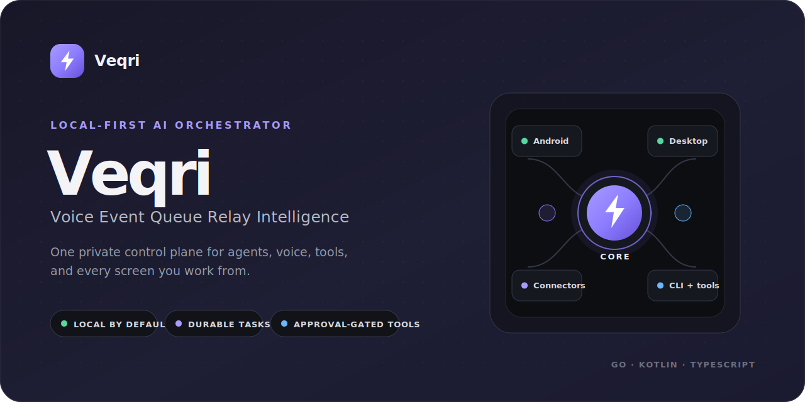
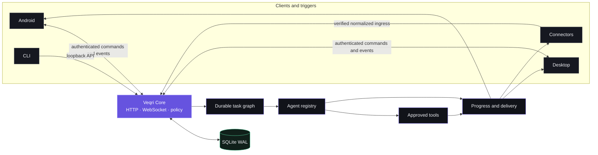

<p align="center">
  
</p>

<h1 align="center">Veqri</h1>

<p align="center">
  <strong>Local-first personal AI orchestration for voice, tasks, tools, and every screen.</strong>
</p>

<p align="center">
  One Go core. Native Android and desktop clients. Durable task graphs.<br>
  Human-approved side effects. No Veqri cloud account required.
</p>

<p align="center">
  <a href="https://github.com/4wl2d/Veqri/actions/workflows/ci.yml"></a>
  
  
  
  
  <a href="./LICENSE"></a>
</p>

<p align="center">
  <a href="#why-veqri">Why Veqri</a> ·
  <a href="#architecture">Architecture</a> ·
  <a href="#operational-status">Status</a> ·
  <a href="#quick-start">Quick start</a> ·
  <a href="#development">Development</a> ·
  <a href="#security">Security</a> ·
  <a href="#documentation">Docs</a>
</p>

---

## What is Veqri?

Veqri is a **local-first personal AI orchestrator** built around a Go daemon and CLI, a native Android client, a React/Wails desktop companion, durable agents and task graphs, approval-gated PC tools, messaging connector boundaries, and a WebRTC-compatible voice control plane.

The default system runs entirely on one machine. External models, STT/TTS, push, TURN, and messaging credentials are adapters, not prerequisites. SQLite on the PC remains authoritative while clients render state and submit authenticated intent.

> [!IMPORTANT]
> This repository contains a runnable MVP, not only a design. Its deterministic default exercises delegation, parallel task graphs, persistence, Android pairing, approvals, connector routing, simulated call/STT/TTS flows, restart recovery, and desktop administration without pretending optional production adapters are already complete.

## Why Veqri

| | |
|---|---|
| **Local by default**<br>Core binds to loopback, persists to a private SQLite WAL database, and does not require a Veqri account or hosted control plane. | **Durable by design**<br>Events, conversations, task graphs, progress, results, approvals, delivery targets, and audit facts survive process restarts. |
| **Controlled side effects**<br>Typed tools pass through capability and risk policy. State-changing work can pause for an expiring, single-use approval. | **One system, several surfaces**<br>Use the CLI, Android app, React/Wails desktop app, signed webhooks, local events, or messaging connector boundaries. |
| **Provider-optional**<br>Cloud models, speech providers, push, TURN, Slack, Mattermost, and Teams credentials can be added without changing the core domain. | **Honest boundaries**<br>Simulators are labelled, incomplete adapters fail closed, and limitations are documented next to operational capabilities. |

## Architecture



Core is a local modular monolith. Provider-specific code normalizes data at the edge; domain packages do not depend on Android, React, Slack, Mattermost, Teams, or a model vendor. See [Architecture](docs/ARCHITECTURE.md) and the [ADRs](docs/adr/) for the decisions behind this shape.

## Operational status

| Area | Current state |
|---|---|
| **Core and persistence** | Operational HTTP/WebSocket APIs, SQLite WAL state, migrations, retention, backups, event dedupe, workers, cancellation, recovery, and audit. |
| **Tasks and agents** | Operational durable graphs, parallel execution, progress, synthesis, and recovery. Built-in domain work is intentionally deterministic and simulated. |
| **Tools and approvals** | Structured shell execution is wired through policy and single-use approvals. Filesystem, Git, and SSRF-hardened HTTP tools are typed policy-ready packages. |
| **Android** | Operational pairing, authenticated command/event stream, conversation, task, approval and call UI, Room cache, DataStore, and Keystore credential storage. |
| **Voice** | Dialog state, call control, Android platform answer playback, and immediate barge-in are operational. The checked-in acoustic WebRTC provider is a clearly labelled no-audio simulator. |
| **Desktop** | React companion and Wails shell work in mock and live-core modes. Native Linux, macOS ARM64/Intel, and Windows x64 build gates are checked in; signed installers and optional tray hooks remain release work. |
| **Connectors** | Signed webhooks and local CLI events are operational. Slack, Mattermost, and Teams have verified ingress/fail-closed boundaries plus deterministic simulators; live outbound needs credentials and provider setup. |
| **Protocol** | Versioned Protobuf/gRPC contracts are generated from one canonical schema. The running MVP edge is HTTP/WebSocket; a live gRPC listener remains an adapter gap. |
| **Optional infrastructure** | Push wake, TURN, cloud AI, cloud STT/TTS, and live messaging credentials are not configured by default. |

## Quick start

### Build the native application

You need **Go 1.26.5** and the native prerequisites for your host. From a fresh checkout:

```sh
git clone https://github.com/4wl2d/Veqri.git
cd Veqri
go run ./cmd/veqri-build
```

The shared builder creates one launchable artifact under `build/release`:

| Host | Output |
|---|---|
| macOS | `Veqri.app` |
| Windows | `veqri-desktop.exe` |
| Linux | `veqri-desktop` |

The desktop executable contains the Wails UI and a managed Core entry point. It starts Core, verifies child ownership and credential compatibility, and stops the managed process when the app closes.

> [!NOTE]
> Native desktop artifacts must be built on their target OS. Current CI builds Linux x64, macOS ARM64/Intel, and Windows x64 artifacts.

### Run Core and the CLI

Build the standalone binaries:

```sh
go run ./cmd/veqri-build binaries
```

Start the secure loopback-only Core in one terminal:

```sh
./build/bin/veqri-core
```

Then use the CLI from another terminal:

```sh
./build/bin/veqri version --json
./build/bin/veqri status
./build/bin/veqri ask --wait "Ask the coding agent to inspect the repository"
./build/bin/veqri task list
```

On first start, Core creates `~/.veqri/veqri.db` and stores the admin credential in the OS keychain, with a clearly reported `0600` fallback on headless systems.

## Choose a surface

<details>
<summary><strong>Desktop app</strong></summary>

### Browser development mode

Mock mode is deterministic and does not need Core:

```sh
cd apps/desktop
npm ci
npm run dev
```

For live mode, copy `apps/desktop/.env.example` to `.env.local`, set `VITE_VEQRI_MODE=live`, point `VITE_VEQRI_CORE_URL` at `http://127.0.0.1:7342`, and use a disposable development token. Never ship an admin token inside browser assets.

### Native shell

```sh
cd apps/desktop
npm run native:build
```

Prefer `go run ./cmd/veqri-build` from the repository root for consistently named `build/release` output. See [Release engineering](docs/RELEASE.md).

</details>

<details>
<summary><strong>Android app</strong></summary>

Build and install the debug client:

```sh
go run ./cmd/veqri-build android
adb install -r build/release/Veqri-android-debug.apk
```

Create a five-minute, single-use pairing code on the PC:

```sh
./build/bin/veqri pair
```

Enter the returned Core URL and eight-digit code on Android. The emulator reaches the host at `http://10.0.2.2:7342`; a physical device needs explicitly configured TLS/LAN access. Android stores its credential in Keystore, while Core stores only its SHA-256 hash.

The APK uses the real Core transport but is debug-signed and is not a store release. Reliable wake while Android is stopped or sleeping requires an optional push adapter; a private LAN socket alone cannot guarantee it.

</details>

<details>
<summary><strong>Approval-gated shell tools</strong></summary>

Read-only structured commands can run under policy:

```sh
./build/bin/veqri shell --wait --cwd "$PWD" pwd
```

A state-changing command waits for a single-use approval:

```sh
./build/bin/veqri shell --cwd "$PWD" touch veqri-approval-demo.txt
./build/bin/veqri approve APPROVAL_ID
./build/bin/veqri task show TASK_ID
```

Use `veqri deny APPROVAL_ID` to verify that the command never executes. Shell interpreters, privilege escalation, paths outside configured workspaces, secret-like environment injection, and automatic retries of state-changing work are denied.

</details>

<details>
<summary><strong>Connectors and local events</strong></summary>

Run every deterministic connector simulator with Core running:

```sh
./scripts/simulate-connectors.sh
```

Submit a local application event:

```sh
printf '{"goal":"Review the completed build"}\n' > /tmp/veqri-event.json
./build/bin/veqri emit build.completed --data /tmp/veqri-event.json --task
```

Progress and the final simulated reply retain the original channel/thread target and remain idempotent across restart. See [Connectors](docs/CONNECTORS.md) for provider-specific authentication and live deployment boundaries.

</details>

## Development

### Repository layout

```text
apps/android/             Kotlin + Compose Android application
apps/desktop/             React + TypeScript desktop companion
cmd/veqri-core/           local daemon entry point
cmd/veqri-cli/            authenticated CLI entry point
core/                     transport-independent domain/runtime packages
connectors/               messaging and local-event adapters
agents/                   built-in and adapter agent implementations
tools/                    structured PC tool implementations
protocol/proto/veqri/v1/  canonical cross-platform contracts
protocol/generated/       reproducible Go and Android Java Lite clients
deploy/                   Docker, systemd, launchd, and Windows assets
docs/                     architecture, security, operations, and ADRs
tests/                    deterministic integration and E2E scenarios
```

### Prerequisites

| Tooling | Version / use |
|---|---|
| Go | `1.26.5` |
| Protobuf | compiler `35.1`, `protoc-gen-go v1.36.11`, `protoc-gen-go-grpc v1.6.2` for regeneration |
| Node | `24.17.0` LTS recommended; desktop also verified on `22.23.1` |
| Android | JDK 21, SDK platform 37, build-tools 37; checksum-verified Gradle 9.4.1 wrapper is included |
| Linux desktop | GTK 3 and WebKitGTK development packages; Ubuntu 24.04 uses `libgtk-3-dev` and `libwebkit2gtk-4.1-dev` |

### Build targets

```sh
go run ./cmd/veqri-build binaries  # Core and CLI
go run ./cmd/veqri-build desktop   # native app for this host
go run ./cmd/veqri-build android   # debug APK
go run ./cmd/veqri-build all       # development-only combined target
```

Official release builds must opt in with `--release` and provide strict SemVer, a full commit hash, and an RFC3339 build time. `build/release/buildinfo.json` records the embedded identity. Android release identity is intentionally outside the combined builder.

### Generate protocol code

```sh
make generate
make check-generated
```

Generated Go clients and the Android Java Lite mirror are committed. `make check-generated` recreates them with pinned tools and rejects tracked or untracked drift.

### Tests and checks

```sh
# Go, integration, E2E, race, and security cases
go test -race ./...
go vet ./...

# Desktop
cd apps/desktop
npm ci
npm run typecheck
npm test -- --run
npm run build

# Android
cd ../android
./gradlew --no-daemon :protocol:checkAndroidProtocolBindings testDebugUnitTest lintDebug assembleDebug
./gradlew --no-daemon assembleRelease assembleDebugAndroidTest
```

Run the routinely available suite from the root with `make test`. After installing native desktop prerequisites, use `make release-check` for release binaries and the packaged-runtime smoke test.

### Deployment

Veqri includes templates for:

- Linux user service: `deploy/systemd/veqri-core.service`
- macOS LaunchAgent: `deploy/launchd/ai.veqri.core.plist`
- Windows service bootstrap: `deploy/windows/install-service.ps1`
- Container image: `docker build -f deploy/docker/Dockerfile -t veqri-core .`

Read [Deployment](docs/DEPLOYMENT.md) before running Core as a background service or exposing it beyond loopback.

## Security

Veqri treats connector messages, model output, web content, files, and command output as untrusted data.

- Core binds to `127.0.0.1:7342` by default.
- A non-loopback bind is rejected unless both `VEQRI_TLS_CERT_FILE` and `VEQRI_TLS_KEY_FILE` are set.
- Capability policy mediates tools; risky commands show exact structured arguments and wait for an expiring approval.
- Emergency stop and per-agent/per-connector kill switches are enforced in Core.
- Secrets are referenced through keychain locators and are not persisted in configuration JSON or logs.
- Rolling content and audit retention is configurable with `VEQRI_RETENTION_DAYS`; `0` retains indefinitely.

Read [Security operations](docs/SECURITY.md) and the [Threat model](docs/THREAT_MODEL.md) before enabling LAN access, remote agents, native app control, or live connectors. Do not open a public issue containing credentials, tokens, private conversations, or unredacted logs.

## Documentation

| Topic | Document |
|---|---|
| System design and durable processing | [Architecture](docs/ARCHITECTURE.md) |
| Local development | [Development](docs/DEVELOPMENT.md) |
| Android client and pairing | [Android](docs/ANDROID.md) |
| Voice boundaries and WebRTC adapter | [Voice](docs/VOICE.md) |
| Messaging and event adapters | [Connectors](docs/CONNECTORS.md) |
| Tools, policy, and approvals | [Tools](docs/TOOLS.md) |
| Protocol contracts | [Protocol](docs/PROTOCOL.md) |
| Security defaults and operations | [Security](docs/SECURITY.md) |
| Deployment and service templates | [Deployment](docs/DEPLOYMENT.md) |
| Release identity and platform matrix | [Release](docs/RELEASE.md) |
| Failure diagnosis | [Troubleshooting](docs/TROUBLESHOOTING.md) |
| Architectural decisions | [ADRs](docs/adr/) |

## Contributing

Focused, tested contributions are welcome. Start with [CONTRIBUTING.md](CONTRIBUTING.md), keep generated protocol output reproducible, and update the relevant security or architecture documentation when a trust boundary changes.

## License

Veqri is licensed under the [GNU Affero General Public License v3.0](LICENSE). The project name and marks are covered by [TRADEMARKS.md](TRADEMARKS.md).
